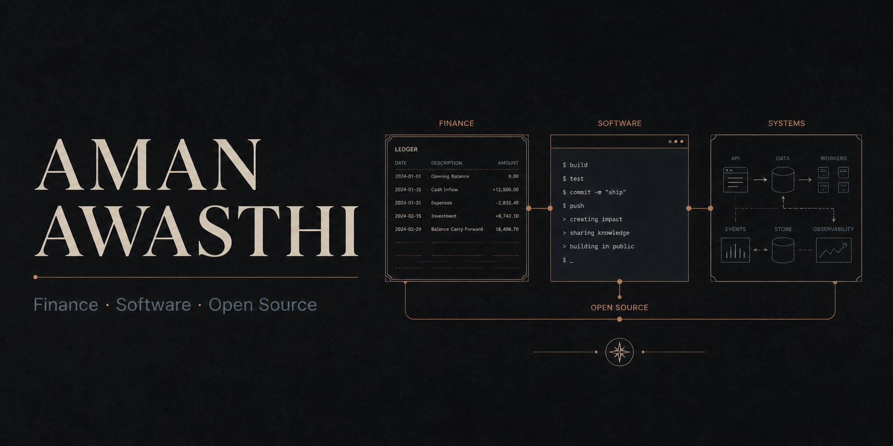

<div align="center">



# Aman Awasthi Portfolio (Legacy)

**Earlier personal portfolio web application and interactive project showcase.**

[**View Live Deployment: amaniaxportfolio.netlify.app →**](https://amaniaxportfolio.netlify.app)

[](https://amaniaxportfolio.netlify.app)
[](https://react.dev/)
[](https://www.typescriptlang.org/)
[](https://vitejs.dev/)
[](https://tailwindcss.com/)
[](https://ui.shadcn.com/)

<p align="center">
  <a href="#status--migration-notice">Status Notice</a> •
  <a href="#features">Features</a> •
  <a href="#quickstart">Quickstart</a> •
  <a href="#commands">Commands</a> •
  <a href="#guidelines">Guidelines</a>
</p>

</div>

---

## Status & Migration Notice

> [!NOTE]
> This repository is maintained as the historical deployment source for `amaniaxportfolio.netlify.app`. 
> Active primary portfolio development and latest design systems occur at [**Aman-Portfolio**](https://github.com/amandeavor/Aman-Portfolio).

---

## Features & Stack

| Area | Technologies & Architecture |
| :--- | :--- |
| **Frontend Framework** | React 18 with Vite bundling and strict TypeScript typing. |
| **Component Architecture** | Modular UI elements built on Radix UI primitives and shadcn/ui. |
| **Motion & Dynamics** | Framer Motion orchestration for hero and section reveals. |
| **Testing & Quality** | Jest and React Testing Library configuration. |
| **API Layer** | Optional lightweight Node.js Express companion service. |

---

## Quickstart

### Prerequisites
- Node.js `18+` LTS
- npm `9+`

### Setup

```bash
# 1. Clone repository
git clone https://github.com/amandeavor/Portfolio.git
cd Portfolio

# 2. Install dependencies
npm install

# 3. Start development server
npm run dev
```

To run the local backend companion API:

```bash
npm run api:dev
```

---

## Available Commands

```bash
# ESLint checks
npm run lint

# Jest test suite
npm test

# Production build
npm run build

# Preview build locally
npm run preview
```

---

## Community & Guidelines

- [Contributing Guide](CONTRIBUTING.md)
- [Security Policy](SECURITY.md)
- [Code of Conduct](CODE_OF_CONDUCT.md)

---

## License

Copyright © 2024–2026 Aman Awasthi. All rights reserved.
